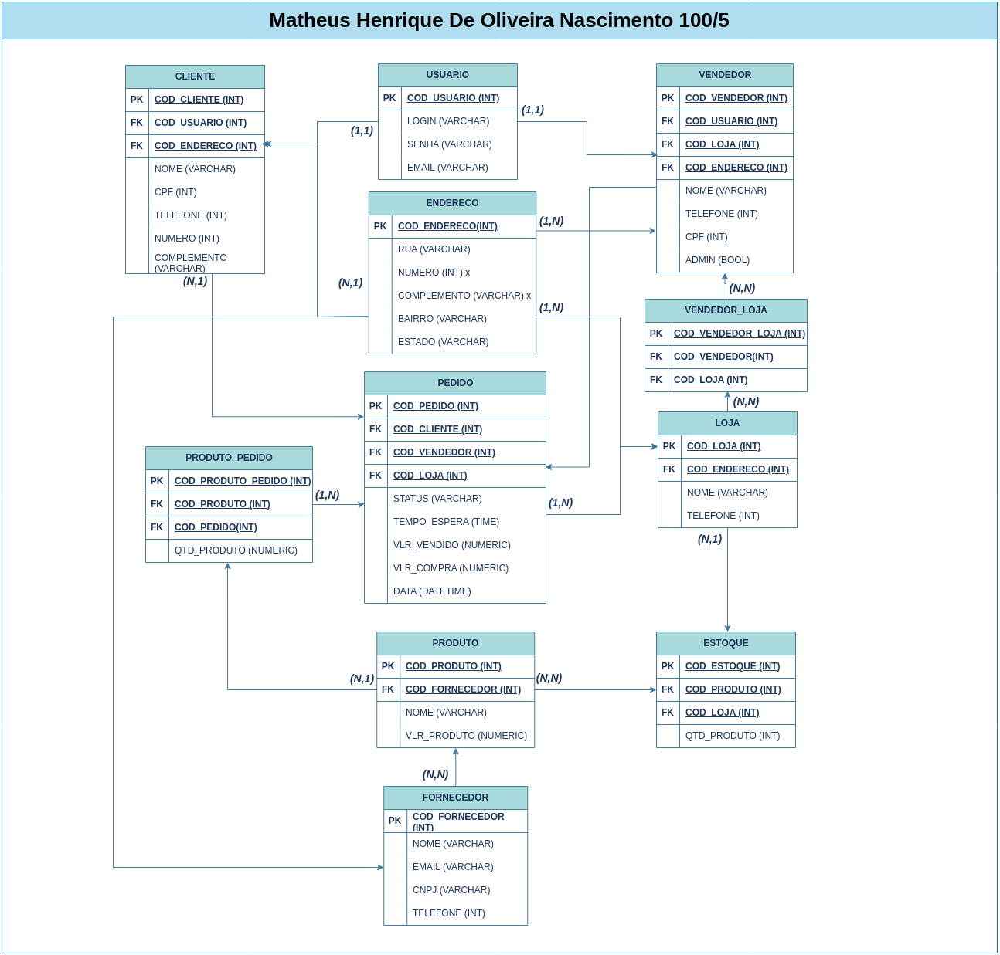

# Ze delivery logico

OBS:
Não adicionei o a tabela relatorio, pois, o DB não foi feito para criar tabelas de relatorios, o que podem ser feitos em sistemas como, Reporting servers, manager studio, SQL, PBI.
Qualquer coisa relacionada a dinheiro coloquei como numeric, pois, não há necessidade de ser exato, mas sim preciso, gastar menos espaço no DB para melhor desempenho.
Numero e completmento para as outras tabelas que tem endereço, pois, numero pode ter varios na mesma rua, pode ter loja, predio e o mesmo no complemento o que gera mais tabelas duplicadas e erros. 

Oque Você achou do meu desing?
Conversei um pouco com o pessoal de DB aqui e eles falaram que NoSQL não esta sendo usado pelo mercado ainda, pois, curva de aprendizagem maior, volatil, não ter relaciomento, interligado e que a escalabilidade não vale tanto a pena se considerar isso, o que acha?

